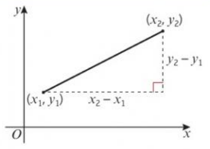
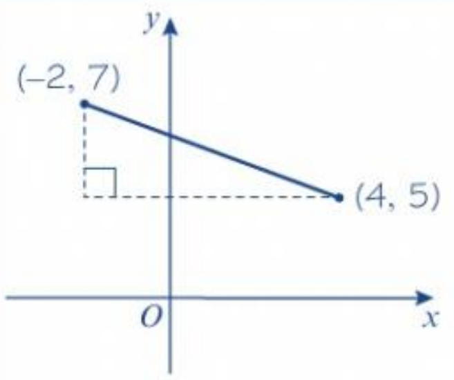
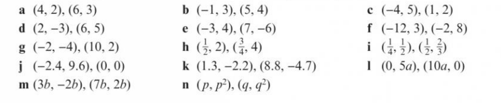

# Chapter5

本章主要讲述一次函数的定义、性质、图象、解析式等内容。

## 5.1 $y = mx + c$

不难发现，这两个点连成的线，在横轴上的距离为 $x_2 - x_1$, 竖轴上的距离为 $y_2 - y_1$。

- 参数 $m$ 的计算公式为 $\frac{y_2 - y_1}{x_2 - x_1}$, 我们称之他为这个一次函数的斜率

:::tip Example 1
计算出这个从(-2, 7) 到 (4, 5) 的斜率m

*解*：
$$
m = \frac{5 - 7}{4 - (-2)} = \frac{-2}{6} = - \frac{1}{3}
$$
:::

:::tip Example 2
从 (2, -5) 到 (4, a) 的直线的斜率为 -1，求a的值

*解*：
$$
因为 \frac{a - (-5)}{4 - 2} = -1
$$
$$
所以 \frac{a + 5}{2} = -1
$$
$$
a + 5 = -1
$$
$$
a = -7
$$

:::

:::info Exercise 5A

1.写出下列两点之间的直线的斜率

2.根据斜率值求出两个点之中的未知数

- (3, -5), (6, a)
- (5, b), (8, 3)
- (c, 4), (7, 6)
- (-1, 2d), (1, 4)
- (-3, -2), (2e, 5)
- (7, 2), (f, 3f)
- (3, -4), (-g, 2g)

:::

:::tip Example 3
写出下列函数/方程的斜率

1. $y = -3x + 2$
2. $4x - 3y + 5 = 0$

*解*：

1. 比较$y = mx + c$, 不难求出斜率 $m = -3$
2. 将此方程变形后的得:
$$
y = \frac{4}{3} + \frac{5}{3}
$$

所以：

$$
m = \frac{4}{3}
$$

:::

:::tip Example 4

以 $ax + by + c = 0$ 的格式写出下列函数

1. $y = 4x + 3$
2. $y = -\frac{1}{2} + 5$

*解*：

1.
$$
4x - y + 3 = 0
$$

2.
$$
\frac{1}{2} + y - 5 = 0
$$

把整个式子乘以2，得：

$$
x + 2y - 10 = 0
$$

:::

:::tip Example 5

直线 $y = 4x - 8$ 与x轴交于点 $P$, 计算出点 $P$ 的详细坐标

*解*：

首先我们需要知道P点的y坐标为0，因为他与x轴相交

我们使y = 0, 然后得到以下式子：

$$
4x - 8 = 0
$$

然后解方程，得：

$$
P(2, 0)
$$

:::